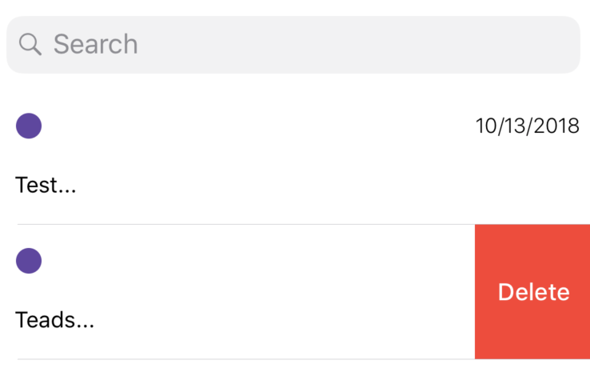
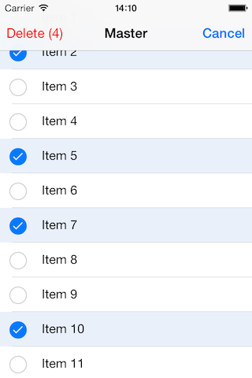
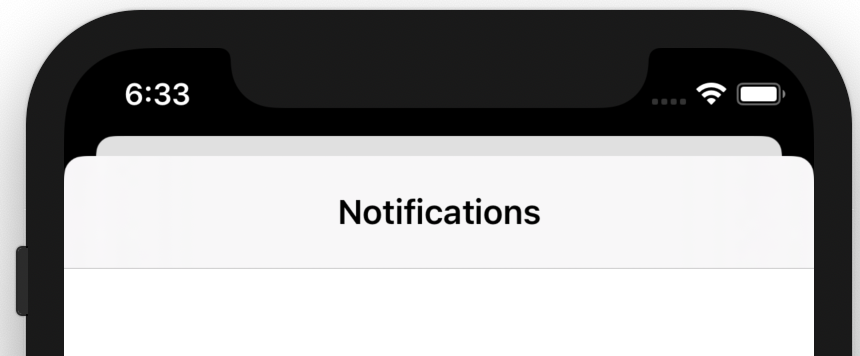

## Exo 1

Supprimer un élément de la liste avec un glisser latéral.

## Exo 2

Rendre la liste modifiable.
L'idée est d'avoir un bouton "Modifier" en bleu système.
Quand tu seras en édition, il sera possible de sélectionner plusieurs éléments afin de les supprimer.

### Exo 3 Formulaire d'ajout de burger

Avoir une nouvelle vue qui se présente en "sheet" ([Comment présenter une view sous forme de sheet](https://www.hackingwithswift.com/quick-start/swiftui/how-to-present-a-new-view-using-sheets)).

Cette vue comportera 5 éléments:
- Annuler la saisie
- Valider la saisie
- Une liste de photos horizontales 
- Un champ texte pour le nom
- Une champ texte pour la description

La sélection d'une photo permettra de l'ajouter à la fiche du burger.
Un contrôle des champs du formulaire est obligatoire.

Bonne chance :smiley: